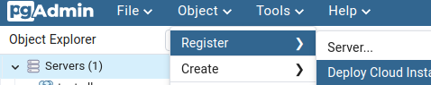
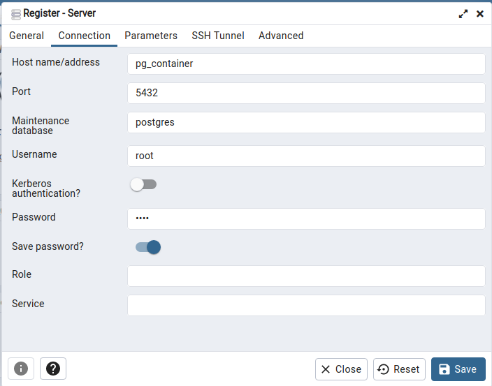

## Ambiente pgAdmin com Docker
<p>Durante a disciplina de Programação com Banco de Dados utilizamos em sala o pgAdmin para realizar o gerenciamentos das base de dados criados, e conseguir práticar com exercícios.</p> 
<p>Por entanto com o intuito de facilitar o acesso ao ambiente pgAdmin, sem que seja necessário realizar a instalação do mesmo em minha máquina criei este repositório contendo o arquivo docker-compose, responsável pela criação e orquestração de dois containers criados com base em imagens do Postgres e pgAdmin.</p>
<h3>Primeiros passos</h3>
<p>Após baixar o código fonte deste repositório em sua máquina, digite o seguinte comando:</p>

```
./cmd run
```

<p>Este comando é só uma forma de tornar mais amigável a execução das instruções contidas no arquivo docker-compose, ele iniciará a construção do container, portanto com ele será executado o 'docker-compose up'</p>
<p>Após isso o container será criado e sua execução será inicializada.</p>
<p>Talvez durante a primeira inicialização demore alguns segundos mas para visualizar a interface do pgAdmin, abra o navegador e navegue para <code>http://localhost:5050</code>, se não aparecer imediatamente recarregue a página algumas vezes e espere um pouco, no login o docker-compose configurou as credenciais padrão como email: admin@admin.com e senha: root</p>

<h3>Registrando server</h3>
</img>
<p>Para criarmos o primeiro servidor aonde será possivel executarmos os comandos, selecione 'Servers' que é o server group que vem como padrão, após isso clique em Object>Register>Server</p>
</img>
<p>O nome do host será o nome do container criado (pg_container), o servidor será executado na porta 5432, conforme especificado no docker-compose na seção Connection o username e password serão root. E em General o nome do servidor pode ser o de sua preferência</p>

<h3>Populando servidor para a prática dos exercícios</h3>
<p>Este repositório contem a pasta files que funciona como o volume do container, ou seja é um diretório em que por meio dele podemos inserir arquivos pelo host e acessá-los de dentro do container, ele possui com dois arquivos: tabelas.sql e inserts.sql, que irão popular o servidor com a base de dados que estamos utilizando para as práticas em sala de aula.</p>
<p>Execute no terminal o seguinte comando: </p>

```
./cmd pop
```
<p>De forma resumida este único comando por trás dos panos realiza uma série de comandos, ele acessa a pasta files de dentro do container e por meio da linha de comando do psql popula o servidor com os arquivos .sql em /files.</br> São vários dados então talvez seja necessário esperar por alguns segundos</p>

<h3>Restaurar tabelas para o estado original</h3>
<p>É muito comum que durante as práticas, aconteçam imprevistos e em alguma operação de inserção ou atualização de dados seja necessário 'resetar' as tabelas, para como elas eram antes. </br> Pra isso execute o comando abaixo:</p>

```
./cmd reset
```
<p>Ele verifica se o servidor foi criado e se o schema do test_tb existe, caso sim, remove todas as tabelas e realiza novamente a inserção e povoamento dos dados, restaurando assim todas as informações para o estado original.</p>

<h3>Imterrompendo execução</h3>
<p>Existem duas formas de parar a execução do container, apertando CTRL+C no terminal aonde ele foi inicializado, ou caso queira, você pode digitar o seguinte comando:</p>

```
./cmd stop
```


